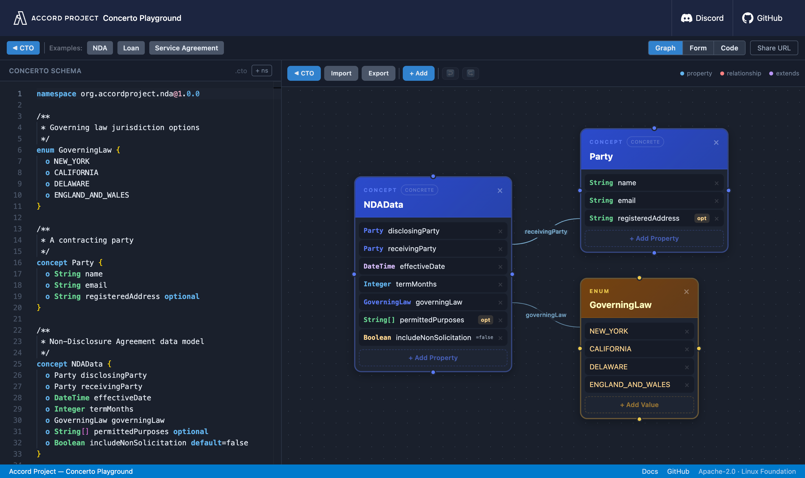

<p align="center">
  <a href="https://concerto-playground.accordproject.org">
    
  </a>
</p>

<h1 align="center">Concerto Playground</h1>

<p align="center">
  Live browser playground for <a href="https://concerto.accordproject.org">Concerto</a> —
  the Accord Project data modeling language that makes
  <em>schemas, for people too</em>.
  <br />
  Sketch a domain model in one <code>.cto</code> file and watch it compile to
  TypeScript, Java, Go, JSON Schema, GraphQL, Protobuf and a dozen more — instantly, in your browser.
</p>

<p align="center">
  <a href="https://concerto-playground.accordproject.org"><strong>Open the playground »</strong></a>
</p>

<p align="center">
  <a href="https://github.com/accordproject/concerto-playground/actions/workflows/test.yml"></a>
  <a href="https://github.com/accordproject/concerto-playground/actions/workflows/e2e.yml"></a>
  <a href="https://github.com/accordproject/concerto-playground/actions/workflows/build-and-publish.yml"></a>
  <a href="./LICENSE"></a>
  <a href="https://www.npmjs.com/package/@accordproject/concerto-core"></a>
  <a href="https://www.npmjs.com/package/@accordproject/concerto-codegen"></a>
  <a href="https://discord.gg/Zm99SKhhtA"></a>
</p>

<p align="center">
  <a href="https://concerto-playground.accordproject.org">
    
  </a>
</p>

---

## What is Concerto?

[Concerto](https://concerto.accordproject.org) is an open-source data modeling language from the [Accord Project](https://accordproject.org) (Linux Foundation, Apache-2.0). It gives you _just enough_ expressivity to capture real-world business concepts — inheritance, relationships, enums, constraints, decorators — while staying readable by engineers and domain experts alike.

Where JSON Schema or XSD tend to become implementation artifacts owned by developers, a Concerto model is designed to be a shared source of truth: precise enough to drive validation and code generation, human enough to be reviewed and understood by product, legal, or operations teams.

At runtime the model is alive: instances are serialized and deserialized against it, validated, and introspectable via a rich API. At build time it compiles to whatever your stack needs:

| Target | Output |
|---|---|
| TypeScript | interfaces |
| Java | POJOs |
| Go | structs |
| C# | classes |
| Rust | structs |
| JSON Schema | draft-07 |
| GraphQL | schema |
| Protobuf | messages |
| Avro | schema |
| OpenAPI | component schemas |
| OData | CSDL |
| XML Schema | XSD |

## Quick start

```bash
npm install
npm run dev
```

Open [http://localhost:5173](http://localhost:5173).

## Deploy

### Vercel
```bash
npm run build
vercel deploy dist/
```

### Cloudflare Pages
```bash
npm run build
# Upload the dist/ directory to a Cloudflare Pages project
```

Target URL: `https://concerto-playground.accordproject.org`

## How it works

1. The Monaco editor on the left accepts one or more Concerto `.cto` schemas (one per namespace tab)
2. On change (debounced 500ms), the generator runs `@accordproject/concerto-codegen` in the browser
3. If live generation fails (e.g., unresolved external model imports), it falls back to pre-generated static output for the sample model — so the playground always shows meaningful content
4. Tabs on the right switch between output languages; a Copy button copies the current output
5. Three view modes — **Graph** (class diagram), **Code** (raw CTO + generated output), and **Form** (point-and-click editor)
6. The "Share URL" button encodes all open namespaces in the URL using LZ-string compression

## Shareable URLs

The URL hash contains the lz-string-compressed model. Paste a Concerto schema, click "Share URL", and the link opens the playground with that schema pre-loaded. Multi-namespace models are encoded as a JSON array in the hash.

## Testing

```bash
npm run test          # unit tests (Vitest)
npm run test:e2e      # end-to-end tests (Playwright, Chromium)
npm run test:e2e:ui   # Playwright UI mode
```

## Links

- [Accord Project](https://accordproject.org)
- [Concerto Documentation](https://concerto.accordproject.org/docs/intro)
- [concerto GitHub](https://github.com/accordproject/concerto)
- [concerto-codegen GitHub](https://github.com/accordproject/concerto-codegen)

## License

Apache-2.0 — Linux Foundation project
